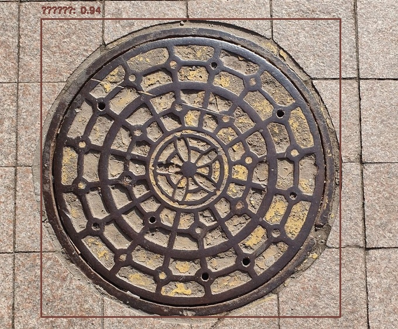

# YOLO v10 기반 공공기물 파손 감지 모델

## 개요
이 프로젝트는 YOLO v10을 사용하여 공공기물 파손을 감지하는 모델을 파인튜닝한 결과물입니다. 해당 모델은 CCTV 또는 기타 감시 카메라 영상에서 파손된 공공기물을 자동으로 탐지하여 경고할 수 있도록 설계되었습니다.

## 특징
- **YOLO v10 기반**: 최신 YOLO v10 모델을 사용하여 높은 정확도와 빠른 속도를 보장합니다.
- **파인튜닝된 모델**: 공공기물 파손 데이터를 수집하고 라벨링하여 YOLO v10을 최적화하였습니다.
- **실시간 탐지 가능**: Edge 장치에서도 원활한 성능을 발휘하도록 경량화하였습니다.
- **다양한 공공기물 지원**: 벤치, 가로등, 버스 정류장, 표지판 등의 파손 여부를 탐지합니다.

## 데이터셋
공공기물 파손 감지를 위해 자체 구축한 데이터셋을 활용하였으며, 주요 내용은 다음과 같습니다:
- **데이터 수집**: 공공장소에서 촬영한 정상 및 파손된 기물 이미지 및 ai hub 공공데이터 활용
- **라벨링**: YOLO 형식에 맞춰 바운딩 박스 어노테이션 적용
- **데이터 증강**: 랜덤 크롭, 회전, 밝기 조정 등을 활용하여 학습 성능 향상

## 모델 학습
### 환경 설정
```bash
pip install -r requirements.txt
```

### 학습 실행
```bash
python train.py --data dataset.yaml --cfg yolov10.yaml --weights yolov10.pt --epochs 100
```

## 사용 방법
### 사전 학습된 모델 다운로드
```bash
wget https://path-to-your-trained-model.com/yolo_v10_vandalism.pt
```

### 실시간 탐지 실행
```bash
python detect.py --weights yolo_v10_vandalism.pt --source test_video.mp4
```

## 결과 예시
실시간 탐지 결과 예제:


## TODO
- 더 많은 공공기물 유형 추가 학습
- Edge 장치 최적화 및 배포 테스트
- 알림 시스템과 연동하여 자동 경고 기능 구현


## 라이선스
MIT License

